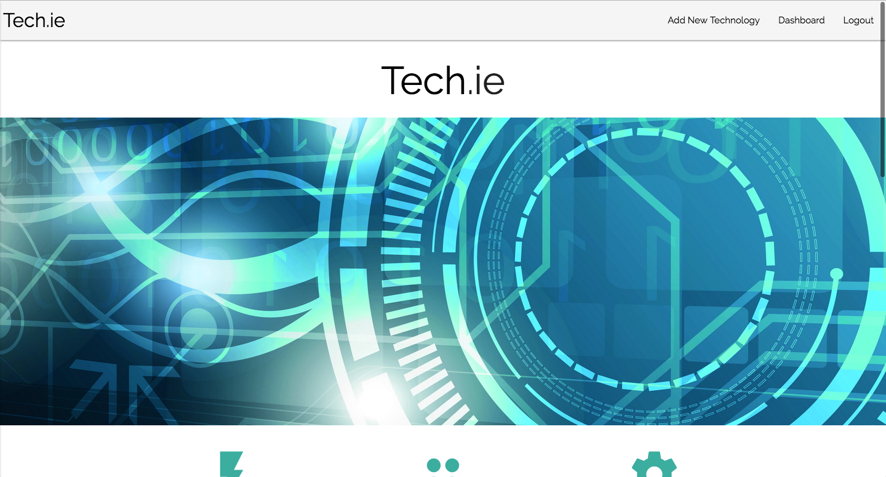

# Tech.ie

## Link to Tech.ie Deployed

[Tech.ie](https://techie-micdrop.herokuapp.com/)

## Description

Our goal was to create a central place for fellow techies to rate and review the different technologies that they use. This would inform the community as to what technologies are trending, essential, obsolete, or just plain cool. Built by developers, for developers, we hope for this app to be an extension of the developer community and conducive to collaboration.

Registered users can click on a category icon from the home page to see all technologies in that category. They can view, review or add a new technology. They also have access to their personal Tech.ie dashboard, which displays a user's profile information, favorite technologies, and reviews that they have posted. It is built for mobile and ready to grow!

## Technologies Used

- HTML
- Sass
- JavaScript
- JQuery
- Express.js
- PostgreSQL
- EJS
- Sequelize
- Materialize
- Github
- Heroku

## Dependencies/Installation Instructions

- bcryptjs
- body parser
- cookie-parser
- debug
- dotenv
- ejs
- express
- express-sessions
- method-override
- nodemon
- passport
- sequelize

Run npm install in terminal to install all dependencies. 

## Build Strategy

Once the idea came to us, we started by wireframing our app and thinking about our user stories. Then we defined all of our database tables and drew up our ERD and relationships. After all of our planning was complete, we divvied up the work. Matt worked on user registration and auth, Mimi worked on our technologies table, and Jerel worked on our categories and favorites tables. Once all those were up and running, we worked together from that point forward in defining all of our routes, grabbing and rendering all of our data from the database, adding CRUD functionality and styling. We were systematic and thorough, and that led to the app-store ready application you see before you. 

## Complications/Future Improvements

Github flow was a challenge at times. We had some merge conflicts that were tricky to navigate. Sequelize can be a bit tricky as well, and the documentation can be hard to decipher. 

For future versions of the Tech.ie app, we would like to add the ability for the user to rate a technology and to view the average user ratings.

We would also like to add the ability for a user to login using their github profile, and to pull available data about a technology from the Github API.

Someday our app will have a search bar....

## User Stories

Our users are programmers who are using our app to find out what what technologies are trending, to find reviews on technologies they may be interested in, or to review a technology that they've used.

[Our Zenhub boards with User Stories](https://github.com/mattkersner/techie#boards?repos=80841283)

## Contributors

Matt Kersner, Jerel Crespo, Mimi Klein (aka, Team Mic Drop).

## Wireframes

